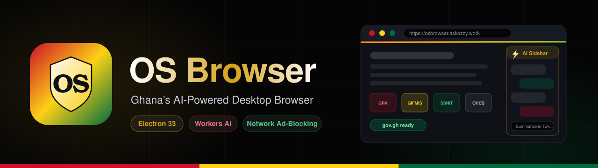
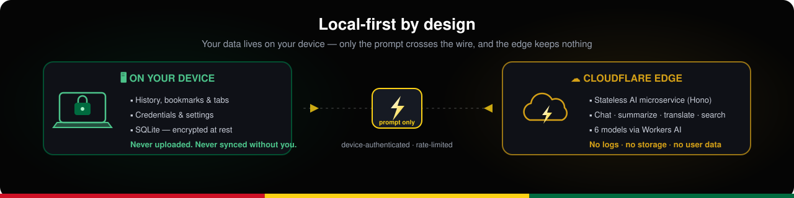
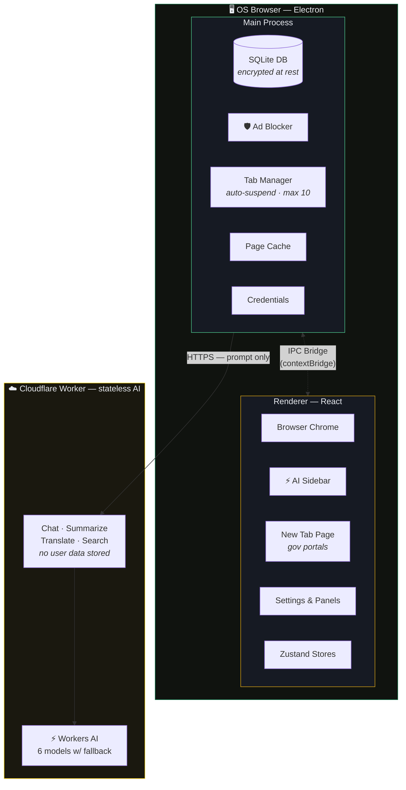

<div align="center">



<br/>

[](https://osbrowser.askozzy.work/)

[](https://github.com/ghwmelite-dotcom/OS-Browser)
[](#-getting-started)
[](https://www.electronjs.org/)
[](https://developers.cloudflare.com/workers-ai/)
[](https://osbrowser.askozzy.work/)

**Built for civil servants. Designed for Ghana. Powered by AI.**

</div>

OS Browser is a standalone desktop browser built specifically for Ghana's public sector. It combines a full Chromium-based browsing experience with built-in AI assistance, government portal quick-access, Twi language translation, network-level ad blocking, and government-grade privacy — all in a beautiful Ghana-inspired interface.

---

## ✨ Key Features

### 🇬🇭 Ghana-First Design
- **Ghana flag color palette** — Gold, Red, Green & Black woven into every surface
- **Pre-loaded government portals** — Ghana.gov, GIFMIS, CAGD, GRA, SSNIT, OHCS, E-SPAR and more
- **Bookman Old Style typography** — Classic, authoritative, distinguished
- **Atmospheric backgrounds** — Ghana colors as ambient lighting in dark & light modes

### 🤖 Built-in AI Assistant
- **6 AI models** — Llama 3.3 70B, DeepSeek R1, Mistral, Qwen 2.5, Gemma via Cloudflare Workers AI
- **AI Sidebar** — Chat, summarize pages, translate to Twi, draft letters, compare options
- **AskOzzy Integration** — One-click access to Ghana's sovereign AI platform
- **Custom AI Agents** — Create specialized assistants with custom system prompts
- **Offline queue** — AI requests queue when offline, process on reconnect

### 🛡️ Privacy & Security
- **Local-first architecture** — All data stays on your device by default
- **Encrypted database** — SQLite with encryption at rest
- **Network-level ad blocking** — Blocks ads, trackers, and malware before they load
- **Government domain whitelist** — Auto-whitelists *.gov.gh to prevent breakage
- **Certificate handling** — Graceful handling of government site certificate issues
- **Download protection** — Warns on executable downloads, blocks insecure sources
- **Privacy mode** — Zero-trace browsing with no history, no cache, no logs

### ⚡ Performance
- **Tab suspension** — Inactive tabs auto-suspend after 5 minutes to save memory
- **Max 10 concurrent tabs** — Prevents memory bloat on government PCs
- **Page caching** — Previously visited pages available offline
- **Delta auto-updates** — Small patches (~5-15MB) instead of full downloads

### 🏛️ Enterprise Ready
- **MSI installer** — Deploy via Group Policy across government networks
- **Silent install** — `msiexec /i OS-Browser.msi /qn`
- **Configurable defaults** — Pre-set privacy mode, portals, and sync settings
- **Bookmark import** — Import from Chrome, Edge, and Firefox

---

## 🔒 Local-first by design

Your browsing life never leaves the machine. The only thing that crosses the wire is the AI prompt itself — answered by a stateless edge worker that keeps nothing.

<div align="center">

</div>

---

## 🏗️ Architecture



---

## 🛠️ Tech Stack

| Layer | Technology |
|-------|-----------|
| Desktop Shell | Electron 33 (Chromium) |
| Frontend | React 18, Tailwind CSS 3, Zustand 5 |
| Backend AI | Cloudflare Workers AI (Hono) |
| Database | SQLite (sql.js) |
| Tab Rendering | WebContentsView |
| Icons | Lucide React |
| Build | Vite 6, esbuild, electron-builder |
| Language | TypeScript 5 (strict) |

---

## 📁 Project Structure

```
os-browser/
├── packages/
│   ├── main/          # Electron main process
│   │   └── src/
│   │       ├── db/           # SQLite + migrations + seeds
│   │       ├── ipc/          # IPC handlers (tabs, history, bookmarks, AI, settings, agents, credentials)
│   │       ├── net/          # Cloudflare client + connectivity monitor
│   │       └── services/     # Ad blocking, page cache, downloads, tray, auto-update
│   │
│   ├── renderer/      # React UI (Vite)
│   │   └── src/
│   │       ├── components/   # Browser chrome, content, sidebar, panels
│   │       ├── store/        # Zustand state (9 stores)
│   │       ├── hooks/        # Keyboard shortcuts
│   │       └── styles/       # Ghana design system (CSS variables)
│   │
│   ├── preload/       # Secure IPC bridge (contextBridge)
│   └── shared/        # Types, models, constants, IPC channels
│
├── worker/            # Cloudflare AI microservice
│   └── src/
│       ├── routes/          # AI chat, summarize, translate, search, compare
│       ├── middleware/      # Device auth, rate limiting
│       └── services/        # Workers AI wrapper with model fallback
│
├── landing/           # osbrowser.askozzy.work landing page
└── docs/              # Design spec + implementation plan
    └── assets/        # README illustrations (SVG)
```

---

## 🚀 Getting Started

### Prerequisites

- Node.js 18+
- npm 9+
- Git

### Development

```bash
# Clone the repository
git clone https://github.com/ghwmelite-dotcom/OS-Browser.git
cd OS-Browser

# Install dependencies
npm install

# Build all packages
npm run build

# Start the renderer dev server
cd packages/renderer && npx vite

# In another terminal, launch Electron
cd OS-Browser
NODE_ENV=development npx electron packages/main/dist/main.js
```

### Deploy the AI Worker

```bash
# Update wrangler.toml with your Cloudflare resource IDs
cd worker
npx wrangler deploy
```

### Package for Distribution

```bash
# Build Windows .exe installer
npm run package:exe

# Build .msi for enterprise deployment
npm run package:msi
```

---

## ⌨️ Keyboard Shortcuts

| Shortcut | Action |
|----------|--------|
| `Ctrl+T` | New tab |
| `Ctrl+W` | Close tab |
| `Ctrl+Tab` | Next tab |
| `Ctrl+Shift+T` | Reopen closed tab |
| `Ctrl+L` | Focus address bar |
| `Ctrl+J` | Toggle AI sidebar |
| `Ctrl+Shift+O` | Open AskOzzy |
| `Ctrl+H` | History |
| `Ctrl+B` | Bookmarks |
| `Ctrl+D` | Bookmark page |
| `Ctrl+P` | Print |
| `F5` | Refresh |
| `F11` | Fullscreen |

---

## 🇬🇭 Government Portals (Pre-loaded)

| Portal | URL | Category |
|--------|-----|----------|
| Ghana.gov | ghana.gov.gh | General |
| GIFMIS | gifmis.finance.gov.gh | Finance |
| CAGD Payroll | cagd.gov.gh | Payroll |
| GRA Tax Portal | gra.gov.gh | Tax |
| SSNIT | ssnit.org.gh | Pensions |
| Public Services Commission | psc.gov.gh | HR |
| Ghana Health Service | ghs.gov.gh | Health |
| Ministry of Finance | mofep.gov.gh | Finance |
| OHCS Platform | ohcs.gov.gh | HR |
| E-SPAR Portal | ohcsgh.web.app | HR/Appraisal |

---

## 🔮 Roadmap

- [ ] **v1.1** — Cloud sync (bookmarks, tabs, settings via Cloudflare D1)
- [ ] **v1.1** — Ga and Ewe language translation
- [ ] **v1.2** — Dagbani, Hausa, Fante translation
- [ ] **v1.2** — Ghana NLP Khaya API integration for better Twi quality
- [ ] **v2.0** — macOS and Linux builds
- [ ] **v2.0** — Browser extension support

---

## 📄 License

Proprietary — Hodges & Co. Limited / ohwpstudios

---

<div align="center">
<strong>Built with ❤️ in Accra, Ghana</strong>
<br />
<sub>Hodges & Co. Limited / ohwpstudios</sub>
</div>
